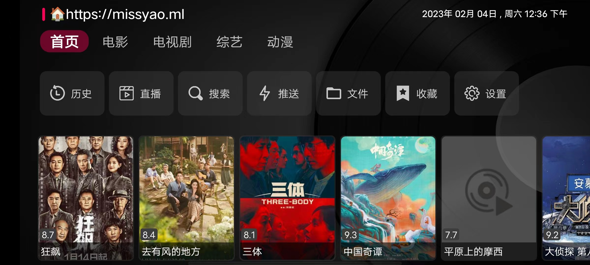

# TVbox
简约个人主页、自适应  
[预览](https://missyao.ml/)

## 简介
一代神器猫影视,由于传播广泛,有些唯利是图之人上架至第三方平台售卖,
开发者无法承担可能面临的版权问题,因此在近期的TG频道中宣布停止维护项目。
一直以来猫影视备受推崇,它提供了灵活强大的自定义影视接口配置,
是目前最强的TV端看片工具,开发者停止维护实属无奈,
我想大部分人也都表示理解,毕竟因纯粹兴趣爱好维护的项目,
在如今版权严峻的年代少之又少，安全必然是首要的。
不过好在,大佬重新出发,在最近几天内开源了一款全新的看片神器,
TVbox,并且在Github上迅速获取大量的关注。
GitHub社区 根据官方代码仓生成的安卓应用。
https://github.com/CatVodTVOfficial/TVBoxOSC

## 使用方法
这还要看嘛？
直播需要支持IPV6
</html>
